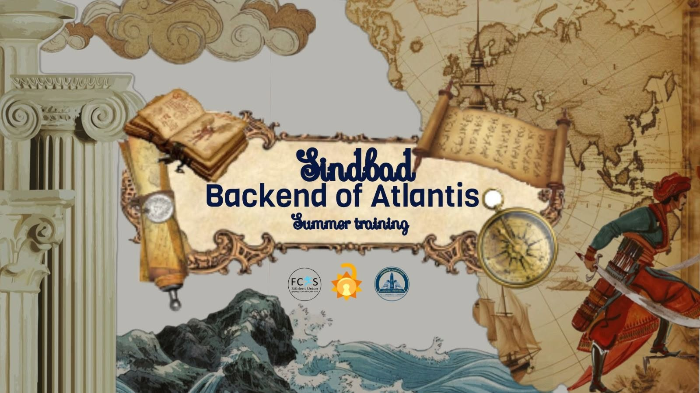
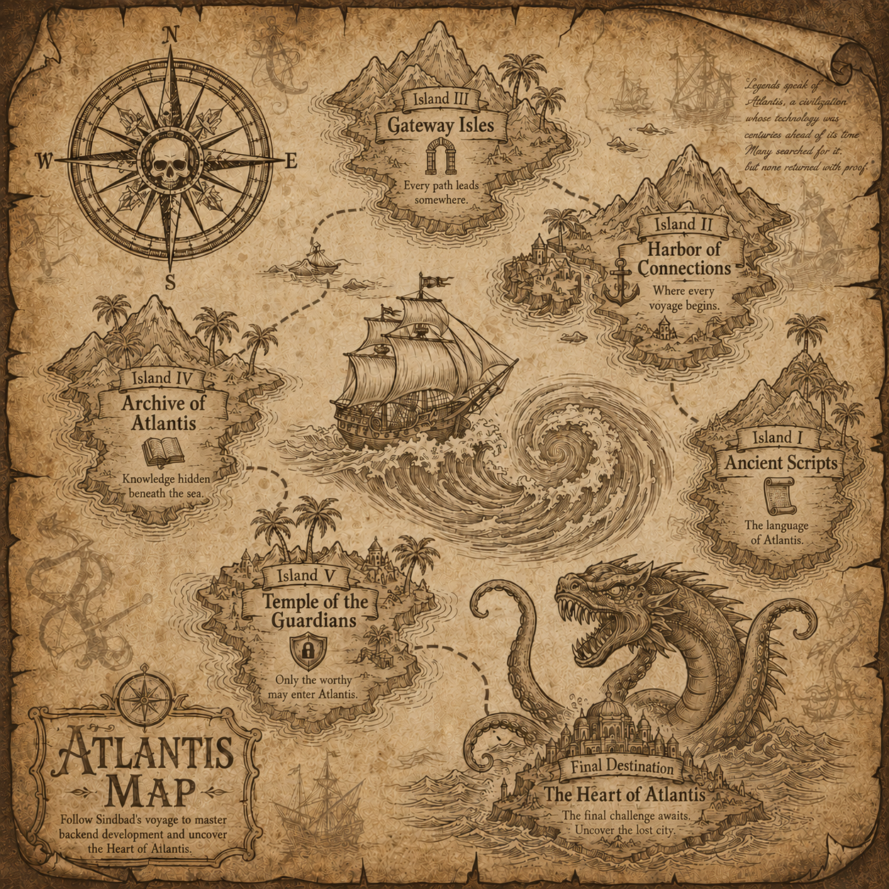

# 🌊 Sindbad: The Backend of Atlantis

### Backend Summer Training 2026

*"Every legendary city has a heart. Every great application has a backend."*

---

## 📖 Story

Legends speak of **Atlantis**, a civilization whose technology was centuries ahead of its time.

Many sailors searched for it.
None returned with proof.

This summer, **Sindbad** begins one final voyage—not in search of treasure, but in search of knowledge.

Every island reveals another piece of the ancient Atlantean technology.
Only by mastering every challenge can he uncover **The Heart of Atlantis**.

Welcome aboard.

---

# 🧭 The Voyage

## 🏝️ Island I — Ancient Scripts

> Learn the forgotten language of Atlantis.

### Topics

- TypeScript Fundamentals
- Async Programming
- Promises
- async / await

---

## ⚓ Island II — Harbor of Connections

> Build your first ship and learn how kingdoms communicate.

### Topics

- Networking Basics
- HTTP
- Node.js
- Express
- Creating Servers

---

## 🌊 Island III — The Gateway Isles

> Every path leads somewhere. Learn to build them.

### Topics

- Routing
- REST APIs
- Project Structure
- CRUD Operations
- Middleware

---

## 🗺️ Island IV — The Archive of Atlantis

> Discover the knowledge hidden beneath the sea.

### Topics

- MongoDB
- Mongoose
- Environment Variables
- API Documentation

---

## 🔐 Island V — Temple of the Guardians

> Only those worthy may enter Atlantis.

### Topics

- Authentication
- Authorization
- JWT
- Deployment

---

# 🏛️ Final Destination

## The Heart of Atlantis

The final challenge.

Build and deploy a complete backend application using everything learned throughout the voyage.

---

# ⚔️ Technologies

- TypeScript
- Node.js
- Express.js
- MongoDB
- Mongoose
- JWT
- bcrypt
- dotenv
- Swagger
- Git & GitHub
- Render / Railway

---

#  What You'll Learn

By the end of this journey you'll be able to:

- Build production-ready REST APIs
- Design clean backend architectures
- Work with MongoDB and Mongoose
- Secure applications using Authentication & Authorization
- Deploy backend applications to the cloud
- Structure scalable Node.js projects
- Think like a backend engineer

---

# Atlantis Map

---

# ⚓ The Crew

Backend Summer Training 2026

Built with ❤️ by the Backend Team.

> "The greatest treasure isn't gold...
>
> It's knowledge."
