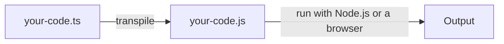
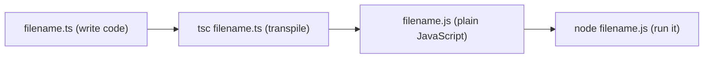
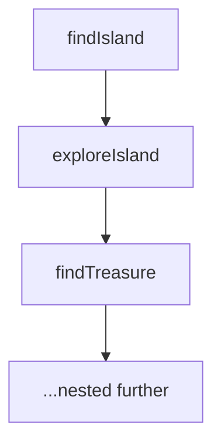
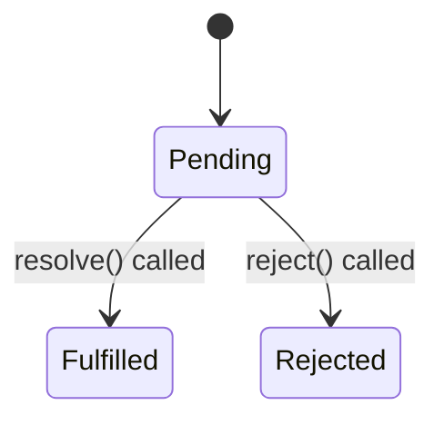
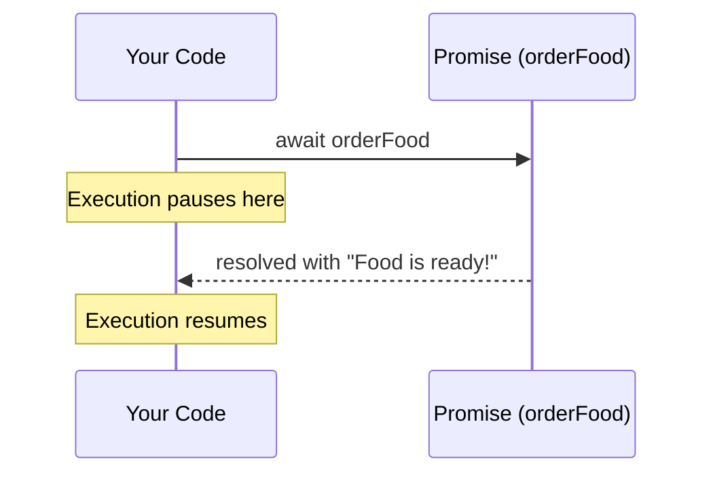

# Island I — Ancient Scripts

## [Slides](https://canva.link/qfiep97r496qnqm)

### Session 1: TypeScript Introduction & Asynchronous Programming

> *"Learn the forgotten language of Atlantis."*

Every legend needs a language. Before Sindbad's crew can build anything, they must first learn to read and write the ancient scripts that power every backend system: **TypeScript**, and the art of doing things **asynchronously** — without freezing the whole ship while waiting on one task.

---

## Table of Contents

### 0. Foundations
- [0. Backend Basics](#0-backend-basics)

### Part 1 — TypeScript
- [1.1 What is TypeScript & Why?](#11-what-is-typescript--why)
- [1.2 Basic Types](#12-basic-types)
- [1.3 Arrays](#13-arrays)
- [1.4 Conditions & Loops](#14-conditions--loops)
- [1.5 Setting Up a TS Project](#15-setting-up-a-ts-project)
- [1.6 Objects & Interfaces](#16-objects--interfaces)
- [1.7 Functions](#17-functions)
- [1.8 Classes](#18-classes)

### Part 2 — Asynchronous Programming
- [2.1 Why Asynchronous Programming?](#21-why-asynchronous-programming)
- [2.2 Timers](#22-timers)
- [2.3 Callbacks](#23-callbacks)
- [2.4 Promises](#24-promises)
- [2.5 Async/Await](#25-asyncawait)
- [2.6 Comparing the Three Approaches](#26-comparing-the-three-approaches)

- [Summary — The Scribe's Checklist](#summary--the-scribes-checklist)

---

## 0. Backend Basics

Before writing a single line of code, it helps to know exactly what a "backend" even is.

> **Backend** = the business logic, database interaction, and communication layer of an app — the part users never see, but the part that makes everything actually work.

| | What it is |
|---|---|
| **Frontend** | What the user sees and clicks on — buttons, pages, colors |
| **Backend** | What makes it work — logic, data, security, behind the scenes |

Think of a restaurant: the **frontend** is the dining room, the menu, the waiter taking your order. The **backend** is the kitchen — where the real work happens, invisible to the customer, but the whole reason the restaurant exists.

### Core Responsibilities of a Backend Engineer

| Responsibility | What it means |
|---|---|
| **Server Logic** | Process user actions and decide how the app should respond |
| **Database Management** | Design how data is stored and retrieved (SQL / NoSQL) |
| **API Development** | Build endpoints so the frontend has a way to talk to the server |
| **Security & Auth** | Protect data, prevent attacks, manage logins |

Everything in this session — and every session after it — is really just building the tools to do these four things well.

---

## Part 1: TypeScript

## 1.1 What is TypeScript & Why?

**TypeScript (TS)** is a **superset of JavaScript (JS)** — meaning it takes everything JavaScript already does, and adds extra features on top of it. The biggest addition: **static types**.

To understand why that matters, we first need to understand two problems with plain JavaScript.

### JavaScript's Two Problems

1. **Dynamic types** — a variable's type can change at any time. This means many mistakes aren't caught until the code is actually running.
2. **Interpreted** — the code runs line by line as it executes, instead of being fully checked beforehand.

### Compile Time vs Runtime

| | Compile time | Runtime |
|---|---|---|
| **What happens** | Code is checked for errors *before* it runs | Code is actually executing |
| **Example** | Your editor underlining a mistake in red | The program crashing while it's running |

Catching a mistake at **compile time** is cheap — you fix it in your editor and move on. Catching it at **runtime** is expensive — it might mean your app crashes in front of real users.

### Dynamic vs Static Typing

- **Dynamic typing** (JavaScript, Python) → type checking happens at **runtime** → errors can show up late, sometimes even in production.
- **Static typing** (C++, Java) → type checking happens **while you're writing the code** → errors are caught early, before anything runs.

> **Note:** JavaScript itself is *interpreted*, not compiled. The red underlines you see in your editor come from your editor's own tooling (like an extension), not from JavaScript itself catching the error.

### The Solution

Microsoft created TypeScript so that:

- Code is **type-annotated** and safer to write.
- Bugs are caught **early**, before the code ever runs.
- **Large projects** become far easier to maintain, since everyone can see exactly what shape of data a function expects.

### Definition

TypeScript is a superset of JavaScript that adds static types, while still allowing dynamic typing when you genuinely need it. It is not "compiled" in the traditional sense — it is **transpiled**, meaning it gets converted into regular JavaScript before it ever runs.



---

## 1.2 Basic Types

TypeScript lets you declare the type of a variable up front:

```typescript
let username: string = "Sindbad";
let age: number = 25;
let isActive: boolean = true;
```

### The `any` Type

Used when you don't know — or genuinely don't care — what type a variable holds. It behaves exactly like plain JavaScript, with **no** type checking at all:

```typescript
let data: any = "hello";
data = 42; // no error — `any` disables type checking entirely
```

> Use `any` sparingly. Reaching for it too often defeats the entire purpose of using TypeScript in the first place.

### Union Types

A variable can be allowed to hold *more than one* type, using the `|` symbol:

```typescript
let id: string | number;
id = "abc123"; // valid
id = 123;      // also valid
```

### Displaying Data

```typescript
console.log("Hello, world!");
```

### Template Literals

Use `${}` inside backticks (`` ` ``) to insert variables directly into a string — this is called **string interpolation**:

```typescript
console.log(`Welcome, ${username}! You are ${age} years old.`);
```

### Comparison: `==` vs `===`

| Operator | Name | What it checks |
|---|---|---|
| `==` | Loose equality | Compares **values only**, ignores type |
| `===` | Strict equality | Compares **both value and type** |

> **Always prefer `===`** in TypeScript/JavaScript — it avoids subtle bugs caused by unexpected type conversions.

```typescript
5 == "5";   // true  — loose: different types, but the same value
5 === "5";  // false — strict: different types
```

---

## 1.3 Arrays

An array is a list of values, and in TypeScript you can specify exactly what type of values it's allowed to hold:

```typescript
let treasures: string[] = ["gold", "map", "compass"];
let scores: number[] = [10, 20, 30];
let mixed: (string | number)[] = ["gold", 100];
```

---

## 1.4 Conditions & Loops

### If Conditions

```typescript
if (age >= 18) {
  console.log("Adult");
} else {
  console.log("Minor");
}
```

### For Loop

Runs a fixed number of times — great when you know exactly how many items you're looping over:

```typescript
for (let i = 0; i < treasures.length; i++) {
  console.log(treasures[i]);
}
```

### While Loop

Keeps running as long as a condition stays true:

```typescript
let i = 0;
while (i < treasures.length) {
  console.log(treasures[i]);
  i++;
}
```

---

## 1.5 Setting Up a TS Project

| Step | Command | What it does |
|---|---|---|
| **1** | Create a file `filename.ts` | Write your TypeScript code |
| **2** | `tsc fileName.ts` | Compiles (transpiles) it into `fileName.js` |
| **3** | `node fileName.js` | Runs the resulting JavaScript file |
| **4** | `tsc --init` | Generates a `tsconfig.json` config file |

The `tsconfig.json` tells the TypeScript compiler how your project should behave. Two of its most commonly used options:

- **`target`** → sets which JS version to output (e.g. `ES2020`).
- **`strict`** → enables all strict type-checking rules — recommended, since it catches far more bugs.



---

## 1.6 Objects & Interfaces

### Object Type

JavaScript naturally groups related data into objects. In TypeScript, we can describe the **shape** that object must have:

```typescript
let sailor: { name: string; role: string; age: number } = {
  name: "Elsiny",
  role: "Navigator",
  age: 24,
};
```

Writing that shape inline gets repetitive fast if you need several objects with the same structure — that's exactly the problem **interfaces** solve.

### Interfaces

Think of an interface like a `struct` in C++: a **reusable blueprint** describing the shape of an object.

```typescript
interface Sailor {
  name: string;
  role: string;
  age: number;
}

const elsiny: Sailor = { name: "Elsiny", role: "Navigator", age: 24 };
const omar: Sailor = { name: "Omar", role: "Warrior", age: 27 };
```

### Optional Properties

Add a `?` after a property name to make it optional — meaning it can be left out entirely:

```typescript
interface Sailor {
  name: string;
  role: string;
  age?: number; // optional — can be omitted
}
```

---

## 1.7 Functions

```typescript
function greetSailor(name: string): string {
  return `Welcome aboard, ${name}!`;
}
```

- `name: string` → the **parameter** type.
- `: string` right after `()` → the **return** type.

### Arrow Functions

A shorter, more modern way to write functions:

```typescript
const greetSailor = (name: string): string => {
  return `Welcome aboard, ${name}!`;
};

// Even shorter, if the function is just a single return statement:
const greetSailor = (name: string): string => `Welcome aboard, ${name}!`;
```

### Typing the Variable Instead

You can also type the *variable* itself with a function type, leaving the arrow function with just the parameter names and body (no types repeated inline):

```typescript
const greetSailor: (name: string) => string = (name) => {
  return `Welcome aboard, ${name}!`;
};
```

Both versions do the **exact same thing** — the only difference is *where* the types are written: directly on the parameters/return, or once, on the variable, as a function type.

---

## 1.8 Classes

*(Not covered in the slides, included here for completeness)*

A **class** is a blueprint for creating objects that bundles data (**properties**) and behavior (**methods**) together — similar to a `class` in C++ or Java.

```typescript
class Sailor {
  name: string;
  role: string;
  age: number;

  constructor(name: string, role: string, age: number) {
    this.name = name;
    this.role = role;
    this.age = age;
  }

  greet(): string {
    return `${this.name} the ${this.role} reporting for duty!`;
  }
}

const elsiny = new Sailor("Elsiny", "Navigator", 24);
console.log(elsiny.greet());
```

- The `constructor` runs automatically the moment you create a new object with `new`.
- **Interface vs Class:** an interface only describes the *shape* of data — no logic at all. A class can hold both data **and** methods (real behavior).

---

## Part 2: Asynchronous Programming

## 2.1 Why Asynchronous Programming?

Imagine you're prepping for a trip, and you have 3 tasks to do:

- Boil water (10 min)
- Cook food (20 min)
- Pack your bag (10 min)

### Synchronous (Blocking)

You do one task fully before starting the next:

```mermaid
gantt
    dateFormat X
    axisFormat %s
    section Synchronous
    Boil water   :0, 10
    Cook food    :10, 30
    Pack bag     :30, 40
```



Boil → Cook → Pack = **40 minutes total.** You're blocked, waiting on each task before you can start the next.

### Asynchronous (Non-Blocking)

You start boiling the water, and **while it's boiling**, you cook and pack at the same time:

```mermaid
gantt
    dateFormat X
    axisFormat %s
    section Asynchronous
    Boil water   :0, 10
    Cook food    :0, 20
    Pack bag     :0, 10
```



Total time = **20 minutes** — you saved 20 minutes simply by not sitting idle while waiting.

### When You NEED Async

- API calls (fetching data from other servers)
- Reading/writing files
- Database queries

### Why Backend Especially Needs Async

A server handles hundreds or thousands of requests at once. Without async, the server would completely **freeze** while waiting on each one, one at a time. Async is what keeps it responsive to everyone at the same time.

---

## 2.2 Timers

Timers let you schedule code to run after a delay, or repeatedly over time.

| Function | What it does |
|---|---|
| `setTimeout()` | Runs code **once**, after a delay |
| `clearTimeout()` | Cancels a pending `setTimeout` before it fires |
| `setInterval()` | Runs code **repeatedly**, every N milliseconds |
| `clearInterval()` | Stops a running `setInterval` |

```typescript
const timeoutId = setTimeout(() => {
  console.log("This runs once, after 2 seconds");
}, 2000);
clearTimeout(timeoutId); // cancels it before it ever runs

const intervalId = setInterval(() => {
  console.log("This runs every 1 second");
}, 1000);
clearInterval(intervalId); // stops it from repeating
```

> **Common pitfall:** forgetting to clear an interval causes it to run forever in the background — this leads to memory leaks and unexpected behavior.

---

## 2.3 Callbacks

**The problem:** async functions don't hand you a result right away — they return immediately, and the *actual result* arrives later. So you need a way to tell them: *"once you're done, call this function."*

> **A callback** = a function passed as an argument to another function, meant to run later, once the async task finishes.

### Analogy

You send a sailor to explore an island (this starts the async task), and tell him: *"come tell me what you find"* (this is the callback). You keep doing other things while you wait. When he returns, he calls you back with the news.

### Node.js Convention

Callbacks conventionally take **two** parameters — an error first, then the result:

```typescript
function exploreIsland(callback: (error: string | null, result?: string) => void) {
  // ...async work happens here...
  callback(null, "Found treasure!"); // (error, result)
}
```

### Callback Hell

When several async operations depend on each other's results, callbacks end up nested inside callbacks, inside more callbacks:

```typescript
findIsland((err, island) => {
  exploreIsland(island, (err, clues) => {
    findTreasure(clues, (err, treasure) => {
      // deeply nested — hard to read, maintain, and debug
    });
  });
});
```



This "pyramid" shape of nested callbacks is:

- Hard to **read**
- Hard to **maintain**
- Full of **repetitive error handling**
- Hard to **debug**

This exact pain is what led to the next solution: **Promises**.

---

## 2.4 Promises

**The fix for callback hell.**

> **A Promise** = an object representing the *eventual* result of an async operation — a placeholder for a value you'll receive at some point in the future.

### Analogy

Ordering food at a restaurant. Your food isn't ready the instant you order it — but the restaurant **promises** it will either deliver your food, or tell you something went wrong.

### The Three States of a Promise



```typescript
const orderFood = new Promise((resolve, reject) => {
  const success = true;
  if (success) {
    resolve("Food is ready!");
  } else {
    reject("Kitchen ran out of ingredients");
  }
});
```

- `resolve` and `reject` are just function parameters — those names are simply the convention. **You** call them explicitly, whenever the async work actually finishes.
- **`resolve()`** → the operation succeeded → the Promise moves from `pending` to `fulfilled`.
- **`reject()`** → the operation failed → the Promise moves from `pending` to `rejected`.

### Getting the Result

```typescript
orderFood
  .then((result) => console.log(result))   // runs if the Promise resolved
  .catch((error) => console.log(error));   // runs if the Promise rejected
```

---

## 2.5 Async/Await

**Syntactic sugar over Promises** — it makes async code *look and behave* like ordinary synchronous code, which makes it far easier to read.

- **`async`** → marks a function as one that works with Promises.
- **`await`** → pauses execution until the Promise settles (can only be used **inside** an `async` function).

```typescript
async function getFood() {
  try {
    const result = await orderFood; // pauses here until resolved or rejected
    console.log(result);
  } catch (error) {
    console.log(error);
  }
}
```



### Key Rules

- `await` only works **inside** `async` functions.
- `async` functions **always** return a Promise, even if you write a plain `return` inside them.
- `await` pauses the function until the Promise **settles** — meaning it either resolves or rejects.

---

## 2.6 Comparing the Three Approaches

| Style | Use when... |
|---|---|
| **Callbacks** | Rarely used directly today — mostly seen in older Node.js APIs |
| **Promises (`.then` / `.catch`)** | You have simple chains, or prefer a functional, chain-based style |
| **Async/Await** | You want clean, sequential code that reads like normal sync code — **most common in modern code** |

The same logic, written three different ways:

```typescript
// Callback version
findIsland((err, island) => {
  exploreIsland(island, (err, treasure) => console.log(treasure));
});

// Promise version
findIsland()
  .then((island) => exploreIsland(island))
  .then((treasure) => console.log(treasure));

// Async/Await version
async function goExploring() {
  const island = await findIsland();
  const treasure = await exploreIsland(island);
  console.log(treasure);
}
```

All three do exactly the same thing — find an island, then explore it, then log the treasure. Notice how the **Async/Await** version reads almost exactly like plain, step-by-step synchronous code, even though everything underneath is still fully asynchronous.

---

## Summary — The Scribe's Checklist

Sindbad's crew has now learned to read the Ancient Scripts. Here's everything mastered on this island:

- **Backend** = server logic + database + APIs + security; the invisible engine behind every app
- **TypeScript** is a superset of JavaScript that adds **static types**, catching mistakes at **compile time** instead of at **runtime**
- TypeScript is **transpiled** into plain JavaScript with `tsc`, not compiled in the traditional sense
- Core types: `string`, `number`, `boolean`, `any`, union types (`string | number`), and typed arrays
- Always prefer **`===`** over `==` to avoid type-coercion surprises
- **Interfaces** define reusable blueprints for object shapes; **classes** bundle data *and* behavior together
- **Synchronous** code blocks and runs one task at a time; **asynchronous** code lets multiple tasks progress without waiting on each other
- **Callbacks** were the first solution to async — but nesting too many creates **callback hell**
- **Promises** represent a future value with three states: `pending`, `fulfilled`, `rejected`
- **Async/await** is syntactic sugar over Promises, letting async code read like ordinary synchronous code

---

### See You on the Next Island

*"Every legendary city has a heart. Every great application has a backend."*

Sindbad's crew has learned the ancient language. Next stop: **Island II — Harbor of Connections**, where the ship learns how kingdoms actually talk to each other.
