# Session 1 Prerequisites: TypeScript Setup and Environment 

Welcome aboard **The Road of Glory to find Atlantis**! Before we set sail in Session 1, every sailor needs their tools packed and ready. This guide walks you through everything you need to install and prepare **before you arrive at the session**.

> ⚠️ **Important:** Please complete every step in this document **before Session 1 begins**. Session time will be spent on TypeScript concepts, not on installations , If you hit a problem you can't solve, reach out to the supporters ahead of time (see the bottom of this document) — don't wait until the session starts.

---

## 📑 Agenda
 
Click any step below to jump straight to it:
 
1. [Step 0: Install Visual Studio Code](#-step-0-install-visual-studio-code-vs-code)
2. [Step 1: Check Prerequisites (Node.js & npm)](#-step-1-check-prerequisites-nodejs--npm)
3. [Step 2: Install TypeScript](#️-step-2-install-typescript)
4. [Step 3: Initialize Your Project](#-step-3-initialize-your-project)
5. [Step 4: Write, Compile, and Run Your First TypeScript File](#-step-4-write-compile-and-run-your-first-typescript-file)
6. [Common Problems & Fixes](#-common-problems--fixes)
7. [Summary Checklist](#-summary-checklist)

---

## Objectives

By the end of this prerequisite guide (completed **before** Session 1), you will be able to:
* Install **Visual Studio Code** (your code editor / ship's cockpit)
* Install **Node.js** and **npm** (Node Package Manager)
* Install **TypeScript** globally on your system
* Initialize a TypeScript configuration file (`tsconfig.json`)
* Compile and run your first TypeScript file, and confirm everything works

> 💡 **Tip:** Don't rush. Read each step fully before typing anything. Most setup problems happen because a step was skipped, not because something is hard.

---

## Step 0: Install Visual Studio Code (VS Code)

VS Code is the code editor we'll use for the entire course. It has a built-in terminal, which means you won't need to open a separate application to run commands — everything happens in one place.

### 0.1 Download VS Code
1. Go to the official website: **https://code.visualstudio.com/**
2. Click the big **Download** button. The website automatically detects your operating system (Windows / Mac / Linux) and offers the correct version.

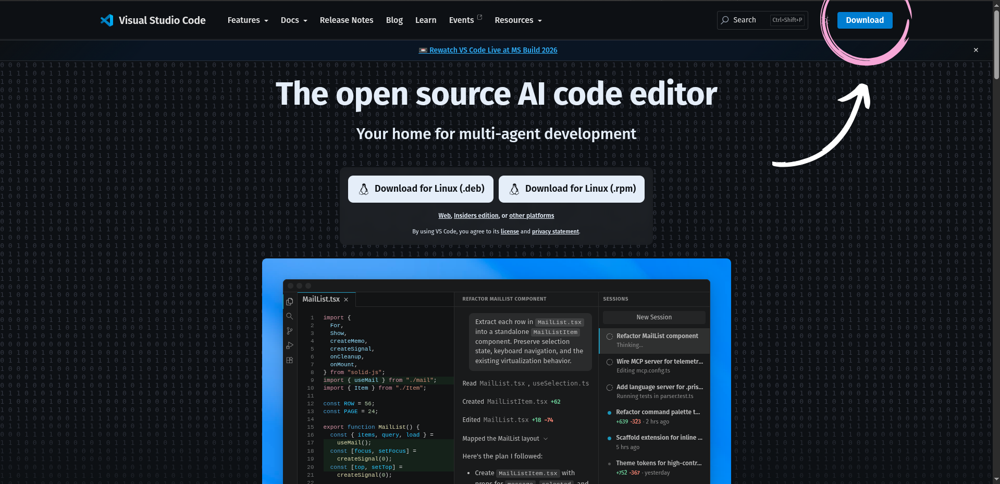
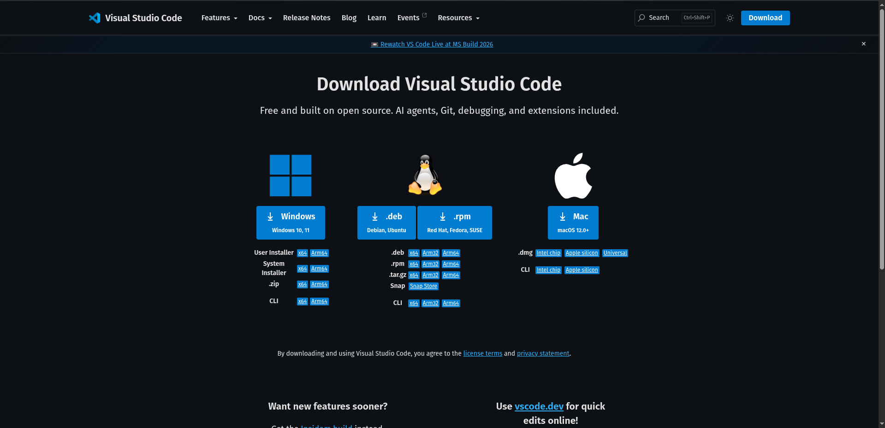

### 0.2 Install VS Code
* **Windows:** Open the downloaded `.exe` file → click **Next** through the setup wizard → make sure the box **"Add to PATH"** is checked (usually checked by default) → click **Install** → **Finish**.
* **Mac:** Open the downloaded `.zip` file → drag the **Visual Studio Code** icon into your **Applications** folder.
* **Linux:** Open the downloaded `.deb` (Ubuntu/Debian) file with your package installer, or follow the `.rpm` instructions shown on the download page for Fedora/RHEL.


### 0.3 Open VS Code and the Terminal
1. Open VS Code from your Start Menu / Applications folder / Taskbar.
2. Open the built-in terminal using one of these methods:
   * Menu bar → **Terminal** → **New Terminal**
   * Keyboard shortcut: `` Ctrl + ` `` (Windows/Linux) or `` Cmd + ` `` (Mac)

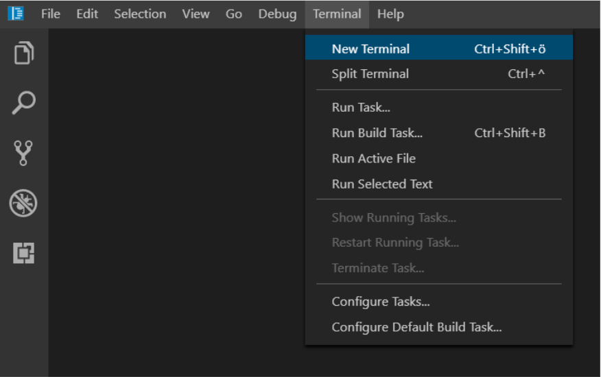
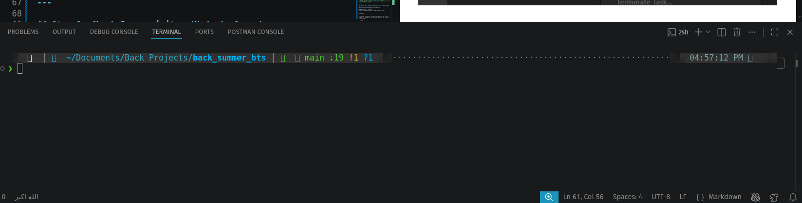

> 💡 **Tip:** You will use this terminal for *every single command* in this guide. Keep it open throughout the whole setup.

---

## Step 1: Check Prerequisites (Node.js & npm)

TypeScript needs **Node.js** (the engine that runs JavaScript outside a browser) and **npm** (the tool that installs packages/libraries, including TypeScript itself). Many computers already have these installed — let's check first before installing anything.

### 1.1 Check if Node.js and npm are already installed
In the VS Code terminal, type the following commands **one at a time**, pressing Enter after each:

```bash
node -v
npm -v
```

* If you see version numbers like `v20.11.0` and `10.2.4` → great, skip to **Step 2**.
* If you see an error like `"node is not recognized"` or `"command not found"` → Node.js is not installed. Continue to **Step 1.2**.

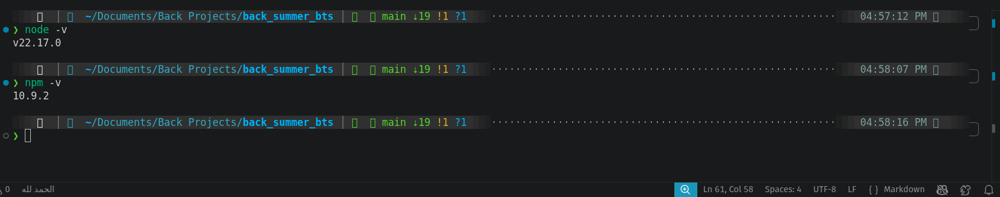


### 1.2 Install Node.js
1. Go to the official Node.js website: **https://nodejs.org/en/download**
2. You'll see a row of dropdown menus: **version**, **for** (your operating system), **using** (install method), and **with** (package manager). Set them like this:
   * **Version:** leave it on the one already selected and labeled **LTS** (Long-Term Support) — this is the stable version recommended for almost everyone. Avoid picking a version without the LTS tag.
   * **for:** choose your operating system — **Windows**, **macOS**, or **Linux**.
   * **using:** leave this on the default option.
   * **with:** leave this on **npm** (the default).
3. As soon as you set these, a box appears below with a ready-made script.

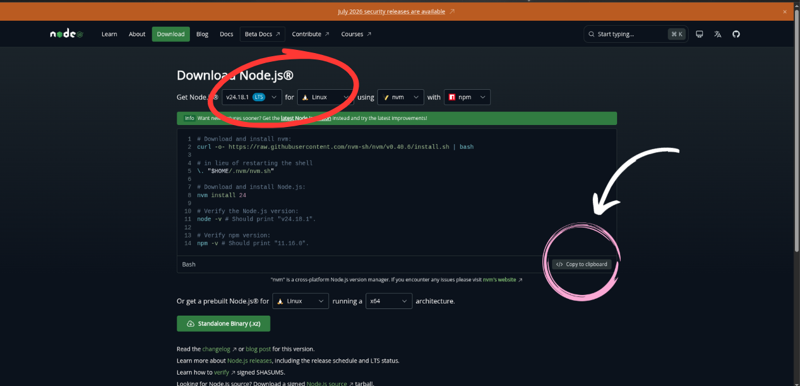

 
4. Click the **"Copy to clipboard"** button on the bottom-right of the code box.


 
5. Paste the copied script into your VS Code terminal and press **Enter**. It will run several lines automatically — this installs a small tool called **nvm**, then uses it to install Node.js itself, then prints the installed `node` and `npm` versions to confirm success.

> ⚠️ **Note on OS compatibility:** Always make sure the **for** dropdown matches your actual operating system before copying the script — a script written for the wrong OS will fail or do nothing.

### 1.3 Verify Node.js and npm again
Close and reopen your VS Code terminal (important — a fresh terminal is needed for the changes to take effect), then run again:

```bash
node -v
npm -v
```

You should now see version numbers for both. If you still see an error, restart your computer once and try again — this fixes the issue most of the time.


---

## Step 2: Install TypeScript

Now that Node.js and npm are ready, we install TypeScript itself. TypeScript is a package, and npm is the tool that installs packages — so we use npm to install TypeScript **globally** (meaning it becomes available everywhere on your system, not just in one folder).

### 2.1 Install TypeScript globally
In the terminal, run:

```bash
npm install -g typescript
```

* The `-g` means "global" — install it once for your whole system.
* This may take a few seconds to a couple of minutes depending on your internet connection. You'll see a progress output and finally a line showing the installed version.

### 2.2 Verify the TypeScript installation
```bash
tsc -v
```

You should see something like `Version 5.4.5`. If you get a "command not found" error:
* Close and reopen your terminal (or restart VS Code) and try again.
* If it still fails on Windows, make sure npm's global folder is in your system PATH (restarting your computer usually resolves this).

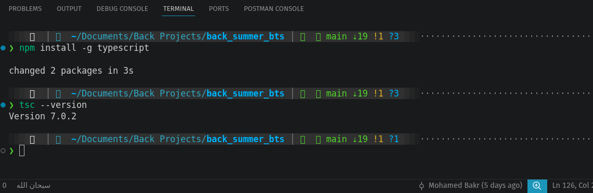

> 💡 **Tip:** `tsc` stands for **T**ype**S**cript **C**ompiler. It's the command that turns your `.ts` files into regular `.js` files that Node (or a browser) can actually run.

---

## Step 3: Initialize Your Project

Every project needs its own folder and its own TypeScript configuration file.

### 3.1 Create a project folder

1. Open the Visual Studio Code application.
2. Click File in the top menu bar.
3. Select Open Folder from the dropdown menu.
4. Choose an existing folder or click New Folder.
5. Click Open to load it into the workspace.
6. Hover over your folder name in the left Explorer panel.
7. Click the New File button (the paper icon with a plus sign).
8. Name your file ex(welcome.ts) and press Enter to save it.

>make sure the file extension is .ts

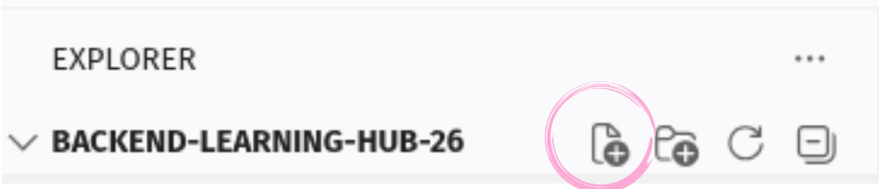


### 3.2 Initialize TypeScript configuration
Inside your project folder, run:

```bash
tsc --init
```

This creates a file called **`tsconfig.json`** — this file tells the TypeScript compiler *how* to compile your code (which JavaScript version to target, which folders to use, strictness rules, etc.). You don't need to understand every line yet; we'll explore it together in later sessions.

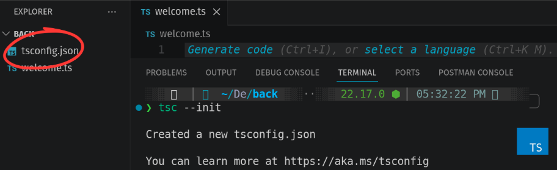


---

## Step 4: Write, Compile, and Run Your First TypeScript File

Now let's prove everything works end-to-end.

### 4.1 Add this code to `welcome.ts`
```typescript
let sailorName: string = "Explorer";
let yearsOfExperience: number = 0;

function welcomeAboard(name: string): string {
  return `Welcome aboard, ${name}! Your journey to Atlantis begins now.`;
}

console.log(welcomeAboard(sailorName));
console.log("Environment check complete. You are ready to sail! ⛵");
```

Save the file (`Ctrl + S` / `Cmd + S`).
> or activate the auto save feature in vs code

### 4.2 Compile the TypeScript file
In the terminal (make sure you're still inside the `typescript-journey` folder):

```bash
tsc 
```

This creates a new file next to it: **`welcome.js`**. This is the compiled, plain JavaScript version of your code — this is the actual file Node.js will run.

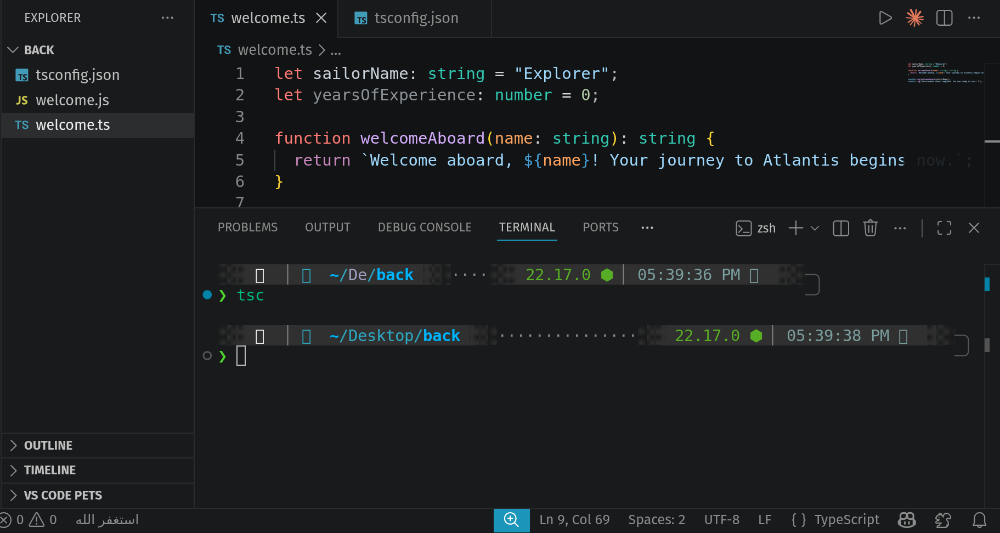


### 4.3 Run the compiled JavaScript file
```bash
node welcome.js
```

### Expected Output
If everything is set up correctly, your terminal should print:

```
Welcome aboard, Explorer! Your journey to Atlantis begins now.
Environment check complete. You are ready to sail! ⛵
```

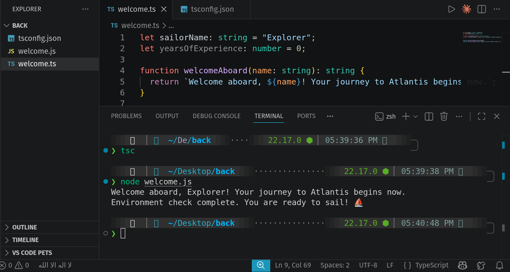


**If you see this output, congratulations — your environment is fully ready!** 🎉

---

## Common Problems & Fixes

| Problem | Likely Cause | Fix |
|---|---|---|
| `node: command not found` | Node.js not installed, or terminal wasn't restarted | Reinstall Node.js, then fully close and reopen VS Code |
| `tsc: command not found` | TypeScript wasn't installed globally, or PATH issue | Re-run `npm install -g typescript`, restart terminal |
| `tsc --init` does nothing / errors | You're not inside your project folder | Run `cd typescript-journey` first, then retry |
| Output doesn't match | Typo in `welcome.ts`, or ran the wrong file | Double check the code was saved before compiling, and that you're running `welcome.js` not `welcome.ts` |
| Windows: install works but commands still fail | PATH not refreshed | Restart your computer once — this fixes it almost every time |

---

## Summary Checklist

Before coming to **Session 1**, make sure you can check off all of these:

- [ ] VS Code is installed and opens correctly
- [ ] `node -v` shows a version number
- [ ] `npm -v` shows a version number
- [ ] `tsc -v` shows a version number
- [ ] You have a `typescript-journey` folder with a `tsconfig.json` inside it
- [ ] Running `node welcome.js` prints the two welcome lines correctly

---

### Supporters will always be there for help :)
If you get stuck at any point, don't struggle alone — reach out on the Support channel in Discord with a screenshot of your terminal and the exact error message. We're here to help you set sail smoothly!