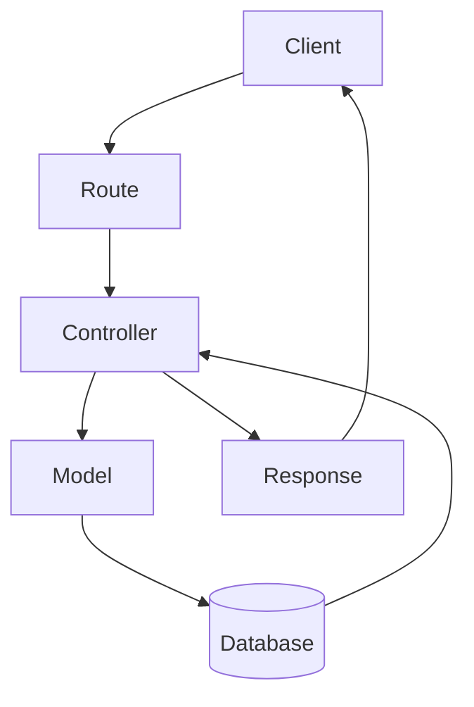
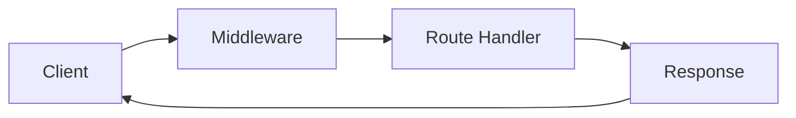

# 🌊 Island III : The Backend of Atlantis

### [Slides](https://canva.link/2a5qa36fwt70t6f)

> *"Every path leads somewhere. Learn to build them."*

Sindbad's ship has reached the third island. This is where the crew stops just *talking* about servers and starts building the actual **doors** that let the outside world walk in and out of an application: **APIs, routes, project structure, CRUD, and middleware.**

---

## 📖 Table of Contents

- [🧭 Quick Recap — Where We Left Off](#-quick-recap--where-we-left-off)
- [Part 1 — API Design & Routing](#part-1--api-design--routing)
  - [1. What is an API?](#1-what-is-an-api)
  - [2. Types of APIs](#2-types-of-apis)
  - [3. RESTful API Conventions](#3-restful-api-conventions)
    - [3.1 Everything is a Resource](#31-everything-is-a-resource)
    - [3.2 HTTP Methods Tell Us WHAT TO DO](#32-http-methods-tell-us-what-to-do)
    - [3.3 REST Naming Conventions](#33-rest-naming-conventions)
    - [3.4 Collections vs. One Resource](#34-collections-vs-one-resource)
    - [3.5 Use Plural Resource Names](#35-use-plural-resource-names)
    - [3.6 Path Parameters vs. Query Parameters](#36-path-parameters-vs-query-parameters)
    - [3.7 Status Codes](#37-status-codes)
    - [3.8 JSON in Requests & Responses](#38-json-in-requests--responses)
    - [3.9 REST Conventions — Summary Cheat Sheet](#39-rest-conventions--summary-cheat-sheet)
  - [4. How the Client Sends Data](#4-how-the-client-sends-data)
  - [5. Project Structure](#5-project-structure)
    - [5.1 Why Structure Matters](#51-why-structure-matters)
    - [5.2 Routes, Controllers, and Models](#52-routes-controllers-and-models)
    - [5.3 The Request Flow](#53-the-request-flow)
- [☕ Break Time](#-break-time)
- [Part 2 — Project Structure & CRUD Operations](#part-2--project-structure--crud-operations)
  - [6. What is CRUD?](#6-what-is-crud)
  - [7. In-Memory Data Store for Development](#7-in-memory-data-store-for-development)
  - [8. Implementing CRUD Operations](#8-implementing-crud-operations)
  - [9. Validating Request Data](#9-validating-request-data)
  - [10. Middleware](#10-middleware)
    - [10.1 What is Middleware?](#101-what-is-middleware)
    - [10.2 The Hidden Journey of Every Request](#102-the-hidden-journey-of-every-request)
    - [10.3 Built-in Middleware](#103-built-in-middleware)
    - [10.4 Custom Middleware](#104-custom-middleware)
      
---

## 🧭 Quick Recap — Where We Left Off

Before this island, the crew already learned:

| Topic | What it means in one line |
|---|---|
| **What is a Network?** | A group of computers connected so they can send data to each other. |
| **IP / Port / DNS / HTTP** | IP = a computer's address · Port = the "door number" on that address · DNS = the phonebook that turns names into IPs · HTTP = the language computers use to talk. |
| **HTTP Request/Response** | Every conversation online is one request ("please give me this") and one response ("here it is / here's what went wrong"). |
| **Node.js vs. Express** | Node.js is the engine that lets JavaScript run outside the browser (e.g., on a server). Express is a toolkit built on top of Node.js that makes building servers much easier and faster. |

If any of that sounds new, it's worth reviewing Session 2 first — everything below builds directly on top of it.

---

# Part 1 — API Design & Routing

## 1. What is an API?

Think about the apps you use every single day: **Instagram, WhatsApp, Talabat...**

They all look different and do different things. But they all secretly have **one thing in common**: they are constantly talking to a server somewhere.

- Every login → a request goes out, a response comes back.
- Every search → a request goes out, a response comes back.
- Every message you send → a request goes out, a response comes back.

So the real question is: **who is in charge of that communication?**

> ### 🔑 API = Application Programming Interface
>
> An API is the **contract** between two applications — usually a **client** (like a mobile app or website) and a **server**. That contract defines exactly *how* the two are allowed to talk to each other: what to ask for, and what shape the answer will come back in.

Think of an API like a **restaurant menu**:
- You (the client) don't walk into the kitchen and cook the food yourself.
- You just tell the waiter (the API) what you want from the menu.
- The kitchen (the server) prepares it and the waiter brings it back.

You never need to know *how* the kitchen works internally — you just need to know the menu (the API) is reliable and consistent.

```
 ┌──────────┐        Request         ┌──────────┐
 │  Client  │ ─────────────────────► │  Server  │
 │ (App/Web)│                        │          │
 │          │ ◄───────────────────── │          │
 └──────────┘        Response        └──────────┘
          The API defines the rules of this conversation
```

## 2. Types of APIs

REST is the most popular style — and the one this training focuses on — but it isn't the only one:

| Type | Common use |
|---|---|
| **REST** ✅ (what we use) | The most common style for web & mobile backends |
| **GraphQL** | Lets the client ask for exactly the fields it needs, nothing more |
| **SOAP** | An older, stricter, XML-based protocol — common in enterprise/banking systems |
| **gRPC** | High-performance communication, often used between internal microservices |

---

## 3. RESTful API Conventions

**REST** stands for **Representational State Transfer**.

A very important idea to internalize first:

> ⚠️ **REST is a *design style*, not a library, framework, or a rule enforced by code.** Nobody stops you from breaking these rules — but if you do, your API becomes confusing and inconsistent for anyone (including future-you) who has to use it.

In a REST API, the client and server exchange data using plain **HTTP** — the same protocol your browser uses to load websites.

REST simply gives us agreed-upon conventions for:
1. How to **name** resources
2. How to **send** requests
3. How to **perform** actions
4. How to **structure** responses

### 3.1 Everything is a Resource

In REST, we stop thinking about "functions" and start thinking about **things** — called **resources**.

For example, in a university system, the resources might be:

- Students
- Courses
- Teachers
- Assignments

Every resource gets its own **URL**:

```
/students
/courses
/teachers
/assignments
```

👉 The URL's job is to describe **WHAT** we're working with — nothing more.

### 3.2 HTTP Methods Tell Us WHAT TO DO

Beginners are often tempted to write URLs like this:

```
❌ /getStudents
❌ /createStudent
❌ /deleteStudent
```

The problem: the *action* ("get", "create", "delete") is baked into the URL itself, which duplicates information that HTTP already gives us for free.

**The easy rule to remember:**

> **URL = WHAT** you're working with
> **HTTP Method = the ACTION** you want to do to it

| HTTP Method | Action | Example |
|---|---|---|
| `GET` | Read / fetch data | `GET /students` |
| `POST` | Create new data | `POST /students` |
| `PUT` / `PATCH` | Update existing data | `PUT /students/5` |
| `DELETE` | Remove data | `DELETE /students/5` |

### 3.3 REST Naming Conventions

Putting the last two ideas together — **use nouns, not verbs**:

| ❌ Avoid | ✅ Prefer |
|---|---|
| `/getStudents` | `GET /students` |
| `/createStudent` | `POST /students` |
| `/deleteStudent/5` | `DELETE /students/5` |
| `/getStudentById/5` | `GET /students/5` |

**Why?** Because the HTTP method *already* tells us the action. Repeating it in the URL ("get...", "create...", "delete...") is redundant — the URL's only job is to describe the resource.

### 3.4 Collections vs. One Resource

The same base URL can mean two different things depending on whether an ID is attached:

- `/students` → the **collection** of all students
- `/students/5` → **one specific** student (the one with ID `5`)

So:

```
GET /students     → "Give me all the students"
GET /students/5   → "Give me student #5"
```

### 3.5 Use Plural Resource Names

| Prefer | Instead of |
|---|---|
| `/users` | `/user` |
| `/products` | `/product` |
| `/orders` | `/order` |
| `/students` | `/student` |

**Why plural?** Because `/users` represents the whole *collection*. Then `/users/7` naturally reads as "one user, taken from that collection." Staying consistently plural makes the API predictable — you never have to stop and guess.

### 3.6 Path Parameters vs. Query Parameters

This is one of the most common points of confusion for beginners, so let's make it very visual:

```
/students/25
            ▲
            └── Path Parameter → "Which student?" (identifies ONE resource)

/students?age=20
             ▲
             └── Query Parameter → "Which students?" (filters a LIST)
```

**Simple rule to remember:**

> 🧭 **Path parameter → Identify** a specific thing
> 🔍 **Query parameter → Filter / Search / Sort** a list of things

### 3.7 Status Codes

When the server finishes handling a request, it doesn't just send data back — it also sends a **status code**: a short, standardized number that tells the client *what happened*, without them needing to read a paragraph of text.

For example: `200` means "all good," while `404` means "I couldn't find what you asked for."

| Code | Meaning | When it happens |
|---|---|---|
| **200** OK | ✅ The request succeeded | Data was successfully fetched/updated |
| **201** Created | ✅ A new resource was created | After a successful `POST` |
| **400** Bad Request | ⚠️ Invalid or missing data | The client sent something malformed |
| **404** Not Found | ⚠️ The resource doesn't exist | Wrong ID, wrong URL |
| **500** Internal Server Error | 🔥 Something broke on the server | An unexpected bug/crash |

### 3.8 JSON in Requests & Responses

**JSON** (JavaScript Object Notation) is the format almost every modern API uses to send data back and forth. Why JSON specifically?

- 📖 **Easy to read** — it looks like a normal nested object: `{ "name": "Sindbad", "age": 25 }`
- 🖥️ **Easy for computers to parse** — nearly every language has a built-in JSON parser
- 🌍 **Language-independent** — JavaScript, Python, Java, etc. can all read and write it
- 🪶 **Lightweight** — small size, ideal for sending over a network

### 3.9 REST Conventions — Summary Cheat Sheet

| # | Rule |
|---|---|
| 1 | Use resources → `/students` |
| 2 | Use HTTP methods → `GET`, `POST`, `PUT`, `PATCH`, `DELETE` |
| 3 | Use nouns, not verbs → `/students` not `/getStudents` |
| 4 | Use plural resource names → `/students` |
| 5 | Use IDs for specific resources → `/students/5` |
| 6 | Use query parameters for filtering/searching → `/students?age=20` |
| 7 | Use appropriate status codes |
| 8 | Use JSON for request/response bodies |
| 9 | Keep naming consistent everywhere |

---

## 4. How the Client Sends Data

There are three main ways a client can send data to the server. Knowing which one to reach for is a core backend skill.

| Method | Purpose | Example |
|---|---|---|
| **URL (Path) Parameters** | Identify ONE specific resource through the endpoint itself | `GET /students/15` |
| **Query Parameters** | Filter, search, sort, or paginate a list | `GET /students?level=3&major=CS` |
| **Request Body** | Send the actual data payload — used when creating or updating something | `POST /students` with a JSON body |

**In more detail:**

**a) URL Parameters** — used to say "I want *this one*."
```http
GET /students/15
```
→ Express route: `app.get('/students/:id', ...)`, and Express gives you the `15` as `req.params.id`.

**b) Query Parameters** — used to narrow down a list.
```http
GET /students?level=3&major=CS
```
→ Express gives you these as `req.query`, e.g. `req.query.level` → `"3"`, `req.query.major` → `"CS"`.

**c) Request Body** — used to send a full chunk of data, typically as JSON, when creating or updating a resource.
```http
POST /students
Content-Type: application/json

{
  "name": "Sindbad",
  "level": 3,
  "major": "CS"
}
```
→ Express gives you this as `req.body` (but only once we teach Express how to read JSON — more on that in the [Middleware](#103-built-in-middleware) section!).

---

## 5. Project Structure

### 5.1 Why Structure Matters

Once your project grows past a handful of routes, dumping everything into one giant file becomes painful. A clean folder structure gives you:

- 🛠️ **Maintainability** — you know exactly where to look to fix or change something
- 📈 **Scalability** — new features slot in cleanly instead of creating a tangled mess
- 🤝 **Collaboration** — teammates can work on different parts without stepping on each other
- 🐞 **Debugging & Testing** — errors are easier to isolate when responsibilities are separated

### 5.2 Routes, Controllers, and Models

A typical Express project is split into three main layers:

#### 🛣️ Routes
- Define the application's API **endpoints (URLs)**.
- Map incoming HTTP requests to the right controller function.
- Handle request methods such as `GET`, `POST`, `PUT`, `DELETE`.
- Should contain **minimal logic** — their only job is to *direct traffic* to controllers.

#### 🎮 Controllers
- Contain the application's **business logic**.
- Receive the request (already routed to them) and process it.
- Talk to **models** to read or modify data.
- Send back the appropriate HTTP response to the client.

#### 🗂️ Models
- Define the **structure/shape** of the application's data.
- Represent collections or tables in a database.
- Handle database operations: create, read, update, delete.
- Enforce data validation and relationships (e.g., "an order must belong to a user").

### 5.3 The Request Flow

Here's how a single request travels through these three layers, from the moment it leaves the client to the moment a response comes back:



In plain words:
1. The **client** sends a request (e.g., `GET /students/5`).
2. The **route** matches the URL/method and hands off to the right **controller** function.
3. The **controller** figures out what needs to happen and asks the **model** for the data.
4. The **model** talks to the **database** to fetch/update the actual records.
5. The data flows back up through the controller...
6. ...which sends the final **response** back to the client.

---

## ☕ Break Time

The session paused here for a short break before diving into CRUD, in-memory storage, and middleware. Good moment to stretch, grab water, and let the REST conventions above sink in — everything after this builds directly on top of them.

---

# Part 2 — Project Structure & CRUD Operations

## 6. What is CRUD?

**CRUD** is the four fundamental things almost every resource-based API needs to be able to do. Each one maps cleanly onto one HTTP method:

| Letter | Operation | HTTP Method | Example |
|---|---|---|---|
| **C** | Create | `POST` | `POST /products` |
| **R** | Read | `GET` | `GET /products` or `GET /products/5` |
| **U** | Update | `PUT` / `PATCH` | `PUT /products/5` |
| **D** | Delete | `DELETE` | `DELETE /products/5` |

If you can build these four operations for a resource, you can build a working API for *almost anything* — students, products, orders, treasures, you name it.

## 7. In-Memory Data Store for Development

Before connecting to a real database, it's common (and genuinely useful) to practice with data that just lives in the server's memory.

> **Definition:** An in-memory data store keeps data in the application's **RAM** instead of a real database — usually just as a plain array or object sitting in your code.

**Key points:**

| ✅ Pros | ⚠️ Trade-offs |
|---|---|
| Fast — no database connection needed | Data is **lost** every time the server restarts |
| Great for learning, prototyping, and testing | Not safe for real users or production traffic |
| Zero setup — just an array in a file | Only suitable for small development projects |

Example of an in-memory store (this is literally just a JavaScript/TypeScript array sitting in a file):

```ts
// data/products.ts
export let products = [
  { id: 1, name: "Magic Lamp", price: 500 },
  { id: 2, name: "Golden Compass", price: 250 },
  { id: 3, name: "Sea Map", price: 120 },
];
```

## 8. Implementing CRUD Operations

**The task:** implement CRUD for a `products` resource, with four controller functions:

| Goal | Function name | HTTP Route |
|---|---|---|
| Get all products | `getAllProducts` | `GET /products` |
| Get one product by ID | `getProductById` | `GET /products/:id` |
| Create a new product | `createNewProduct` | `POST /products` |
| Delete a product | `deleteProduct` | `DELETE /products/:id` |

Here's what each controller function looks like using the in-memory array above:

```ts
import { Request, Response } from "express";
import { Product, products } from './../models/product.model';
export const getAllProducts = (req: Request, res: Response) => {
    return res.status(200).json({
        message:"Products getted successfully",
        products
    })
}

export const getProductById = (req: Request, res: Response) => {
    const productId = Number(req.params.id);
    if (!productId) {
        return res.status(400).json({
            message: "Id is Required"
        })
    }
    let product = products.find((product) => {
        return productId === product.id
    })
    if (!product) {
        return res.status(400).json({
            message: "No Product for this id"
        })
    }
    return res.status(200).json({
        message: "Product getted successfully",
        product,
    })
}
export const createNewProduct = (req: Request, res: Response) => {
    const { name, price, category, inStock } = req.body
    const product: Product = {
        id: products.length + 1,
        name,
        price,
        category,
        inStock
    }
    products.push(product);
    return res.status(201).json({
        message: 'Product getted sucessfully',
        product,
    })
}
export const deleteProduct = (req: Request, res: Response) => {
    const productId = Number(req.params.id);
    if (!productId) {
        return res.status(400).json({
            message: "Id is Required"
        })
    }
     let productIndex = products.findIndex((product) => {
        return productId === product.id
    })
    if (productIndex===-1) {
        return res.status(400).json({
            message: "No Product for this id"
        })
    }
    products.splice(productIndex,1);
    return res.status(200).json({
        message:"product deleted successfully",
    })
}
```

Notice how closely this mirrors the CRUD table above — that's the whole point of REST conventions: once you know the pattern, you can predict the API without reading extra documentation.

## 9. Validating Request Data

**Request validation** is the process of checking incoming client data *before* processing it, to make sure it's complete and in the correct format.

Why bother? Validation:

- ✅ Ensures required fields are actually provided
- ✅ Verifies data types and formats (e.g., price should be a number, not text)
- 🛡️ Prevents invalid or malicious data from entering the application
- 📈 Improves overall reliability and security

A simple example — rejecting a `POST /products` request that's missing a name or price:

```ts
if (!req.body.name || !req.body.price) {
  return res.status(400).json({ message: "Name and price are required" });
}
```

This is such a common need that it's usually implemented as **middleware** — which brings us to the next (and final) big topic of this island.

---

## 10. Middleware

### 10.1 What is Middleware?

> **Middleware** is a function that executes **between** the request and the response.

It intercepts every incoming request *before* it reaches the route handler, letting your application **modify**, **validate**, or even **terminate** the request before a response is ever sent.

### 10.2 The Hidden Journey of Every Request

Every API request begins with a destination in mind — but before it can reach your route, it has to pass through a series of invisible checkpoints, working quietly behind the scenes:

- Some **inspect** the request.
- Some **record** what happened (logging).
- Some **verify** the user's identity (authentication).
- Others **decide** whether the request is even allowed to continue.

These behind-the-scenes functions are called **middleware**.



Put simply, middleware acts like a **checkpoint** where you can:

- Execute custom code
- Validate incoming data
- Authenticate users
- Log requests
- Modify the request or response before it moves on

A middleware function in Express always has the same shape — it receives the request, the response, and a special `next` function that tells Express "I'm done, pass this along":

```ts
function exampleMiddleware(req: Request, res: Response, next: NextFunction) {
  // do something with req/res here...
  next(); // pass control to the next middleware or route handler
}
```

If `next()` is never called, the request simply **stops** there — it never reaches the route handler. That's how middleware can "gate" a request (for example, blocking it if the user isn't logged in).

### 10.3 Built-in Middleware

Express ships with a few built-in middleware functions that handle common tasks without needing extra packages — for example `express.json()` and `cookieParser()`.

**The problem `express.json()` solves:**

> If a client sends JSON data in the request body, how does Express know how to read it?
>
> **It doesn't** — unless we explicitly tell it to, using `express.json()`.

Among all the built-in middleware, `express.json()` is the one you'll use constantly. It:

1. Reads the raw JSON data sent in the request body.
2. Converts it into a real JavaScript object.
3. Stores it on `req.body`.

**Without `express.json()`:**

```ts
app.post("/products", (req, res) => {
  console.log(req.body); // undefined ❌
});
```

**With `express.json()`:**

```ts
app.use(express.json()); // 👈 register it once, near the top of app.ts

app.post("/products", (req, res) => {
  console.log(req.body); // { name: "Golden Compass", price: 250 } ✅
});
```

Without it, `req.body` stays `undefined`, because Express doesn't parse JSON automatically — you have to opt in.

### 10.4 Custom Middleware

Beyond the built-in ones, you can — and very often will — write your **own** middleware for tasks specific to your app, such as:

- Logging incoming requests
- Validating request data
- Checking authentication or authorization

**Example: a simple logger middleware**

```ts
// middleware/logger.ts
import { Request, Response, NextFunction } from "express";

export function logger(req: Request, res: Response, next: NextFunction) {
  console.log(`${req.method} ${req.url} - ${new Date().toISOString()}`);
  next();
}
```

**Example: a simple validation middleware** (rejecting incomplete product data before it ever reaches the controller):

```ts
// middleware/validateProduct.ts
import { Request, Response, NextFunction } from "express";

export function validateProduct(req: Request, res: Response, next: NextFunction) {
  const { name, price } = req.body;

  if (!name || typeof price !== "number") {
    return res.status(400).json({ message: "Invalid product data" });
  }

  next();
}
```

Then plug it directly into a route — Express runs it *before* the controller:

```ts
router.post("/", validateProduct, createNewProduct);
```

This is the real power of middleware: it lets you keep controllers clean and focused purely on business logic, while cross-cutting concerns (logging, validation, auth) live in their own reusable functions.

---

## 📌 Final Recap

By the end of Island III, you should be comfortable with:

- ✅ What an API is, and why REST is the most common style
- ✅ REST conventions: resources, HTTP methods, plural nouns, path vs. query params, status codes, JSON
- ✅ The three ways a client sends data: URL params, query params, request body
- ✅ Why project structure matters, and the Route → Controller → Model → Database flow
- ✅ CRUD operations and how they map to HTTP methods
- ✅ In-memory data stores as a lightweight tool for learning and prototyping
- ✅ Request validation, and why it matters
- ✅ Middleware — both built-in (`express.json()`) and custom (loggers, validators)

---

### 🏛️ See you on the next adventure with Sindbad

Next stop: **Island IV — The Archive of Atlantis**, where the crew dives into MongoDB, Mongoose, environment variables, and API documentation.

*"The greatest treasure isn't gold... it's knowledge."*
