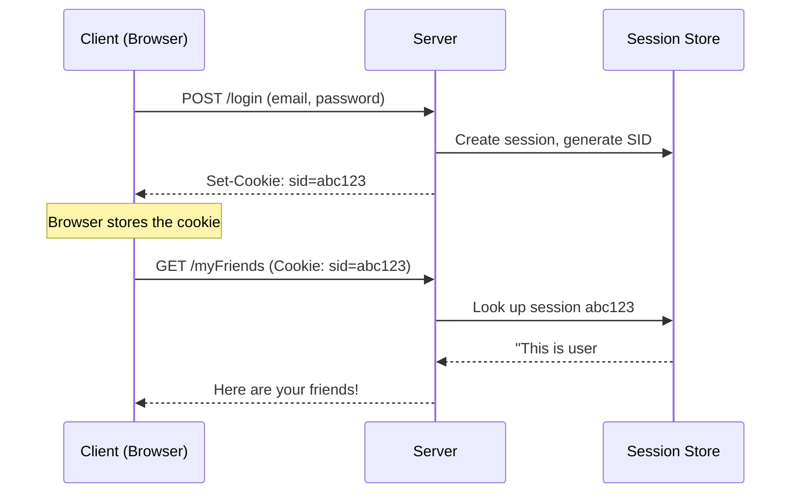
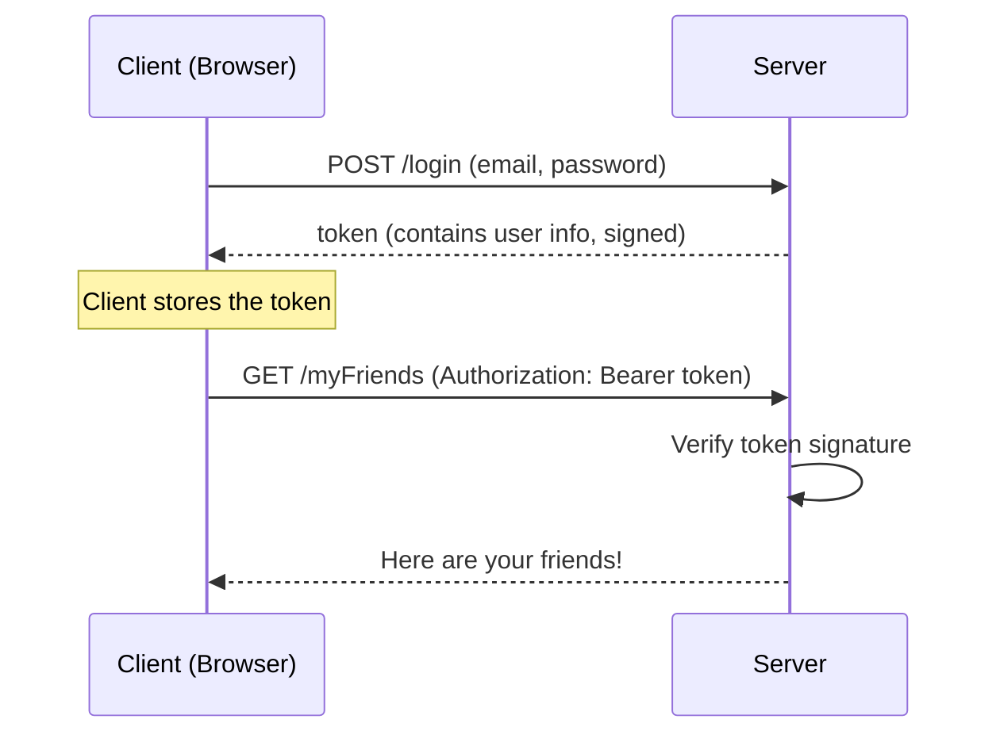
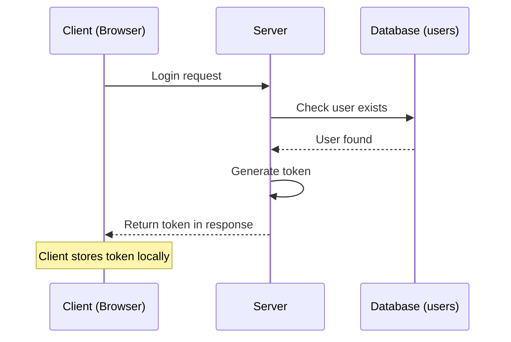
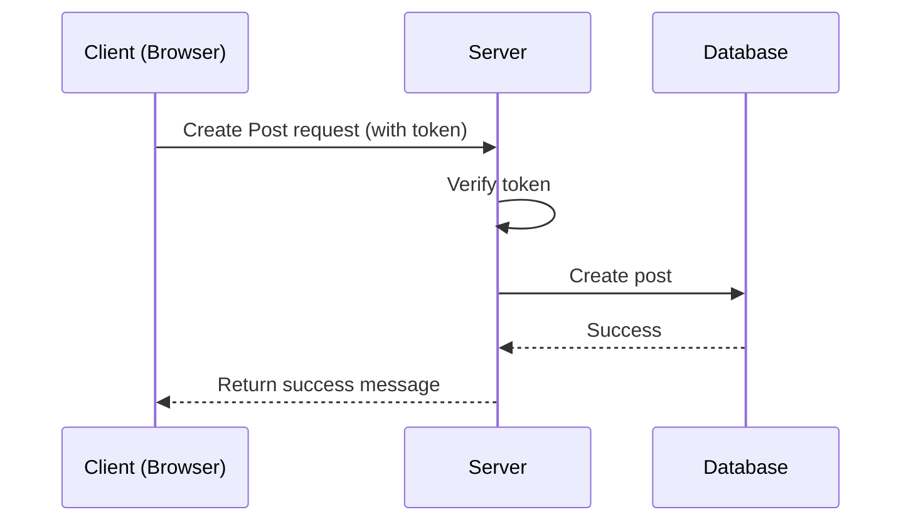
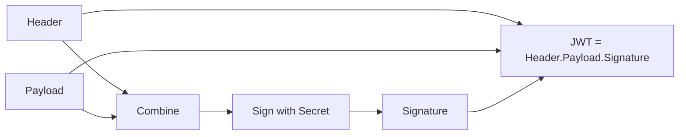
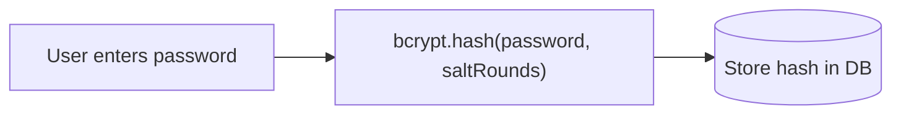
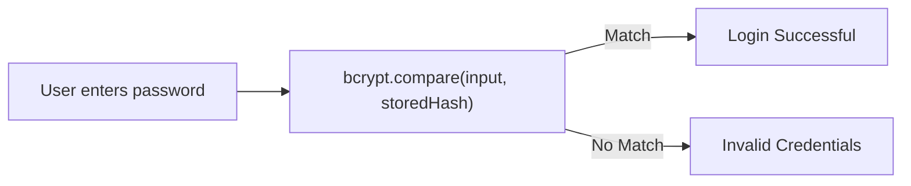
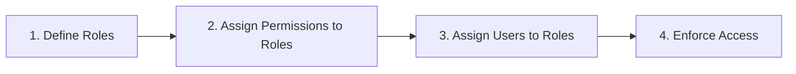
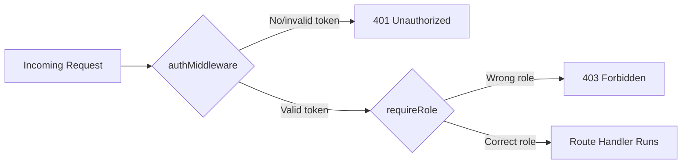

# Island V — Temple of the Guardians

## [Slides](https://canva.link/1a3zikvasylmdj3)

### Session 5: Authentication, Authorization & Deployment

> *"Only those worthy may enter Atlantis."*

Sindbad has sailed through the Ancient Scripts, the Harbor of Connections, the Gateway Isles, and the Archive of Atlantis. Now his ship reaches the **Temple of the Guardians** — the island where every visitor is stopped at the door and asked two questions:

1. **"Who are you?"** → this is **Authentication**
2. **"What are you allowed to do here?"** → this is **Authorization**

By the end of this session you'll be able to answer both questions in your own backend, and even send your API out into the real world with **Deployment**.

---

## Table of Contents

### Part 1 — Authentication
- [01. What is Authentication?](#01-what-is-authentication)
- [02. The Problem: HTTP Forgets You](#02-the-problem-http-forgets-you)
- [03. Solution 1 — Session-Based Auth](#03-solution-1--session-based-auth)
- [04. Solution 2 — Token-Based Auth](#04-solution-2--token-based-auth)
- [05. Session vs Token — Which One Wins?](#05-session-vs-token--which-one-wins)
- [06. Where Does the Token Live? Cookies vs Local Storage](#06-where-does-the-token-live-cookies-vs-local-storage)
- [07. What Actually *Is* a Token?](#07-what-actually-is-a-token)
- [08. JWT — JSON Web Token](#08-jwt--json-web-token)
- [09. Password Hashing with bcrypt](#09-password-hashing-with-bcrypt)
- [10. User Registration & Login Flow (Full Code)](#10-user-registration--login-flow-full-code)

### Part 2 — Authorization & Deployment
- [11. What is Authorization?](#11-what-is-authorization)
- [12. Role-Based Access Control (RBAC)](#12-role-based-access-control-rbac)
- [13. Protecting Routes with Auth Middleware](#13-protecting-routes-with-auth-middleware)
- [14. Deployment — Sending Your API to Sea](#14-deployment--sending-your-api-to-sea)
- [15. Summary — The Guardian's Checklist](#15-summary--the-guardians-checklist)

---

## Quick Recap — Before You Enter the Temple

Before this island, Sindbad's crew already learned:

| Topic | What it means |
|---|---|
| **NoSQL Databases** | Databases that store flexible, JSON-like data instead of rigid tables |
| **Collections & Documents (MongoDB)** | A *collection* is like a folder, a *document* is like one JSON record inside it |
| **HTTP** | The language browsers and servers use to talk to each other |
| **Environment Variables** | Secret settings (like passwords or URLs) kept *outside* your code, in a `.env` file |

If any of these feel fuzzy, it's worth a quick refresher — everything in this session builds on top of them.

---

## 01. What is Authentication?

**Authentication answers one question: "Who are you?"**

We need a reliable way for the server to identify *which* client is talking to it. You already do authentication dozens of times a day without thinking about it:

- Showing your ID card at a gate
- Unlocking your phone with a password
- Using your fingerprint or Face ID
- Logging into an app with an email and password

> **Key idea:** Authentication is about *proving identity*. It always happens **before** Authorization (which decides what you can *do*). You can't check someone's permissions until you know who they are.

---

## 02. The Problem: HTTP Forgets You

Let's borrow a story from the slides — **imagine you're calling Vodafone customer support.**

1. You call: *"Hi, I have a problem with my internet…"*
 The employee starts helping you… and the call drops.
2. You call again: *"Hi, I called a few minutes ago."*
 The employee: *"Okay… what's your problem?"* — they don't remember you at all.
3. You get frustrated: *"I already explained everything!"*
 Employee: *"Sorry, I don't remember."*

Now translate this into your backend:

```text
Client → POST /login { email, password }
Server → "Sure, here is your profile!"

Client → GET /myFriends
Server → "Sorry, I don't remember who you are?"
```

### Why does this happen?

> **HTTP is stateless.**

Just like the support employee doesn't automatically remember your last call, **the server does not automatically remember previous HTTP requests.** Every request arrives completely on its own — with no memory of what happened before it.

This means: when a user logs in successfully, *your backend needs a deliberate way* to remember them on every future request. That's the entire problem Authentication solves.

**So — how can Vodafone recognize you when you call back?**

Their first (simple) fix: *"Hi, I'm customer 12345."* Vodafone keeps your details on **their side**, and you just hand over an ID number. That one idea — "keep the data on the server, give the client only an ID" — is the seed of our first real solution: **Sessions**.

---

## 03. Solution 1 — Session-Based Auth

**How it works:**

1. The user logs in.
2. The server creates a **session** and stores the session data (server-side memory or a database).
3. The server generates a **Session ID (SID)**.
4. The SID is sent back to the client as a **cookie**.
5. The browser automatically attaches that cookie to **every future request**.



The server now "remembers" you — because *it* keeps the record, and you just carry the receipt.

### But... what about scale?

> "What if Vodafone has millions of customers?"

Storing a session for every single logged-in user works fine for a small app, but for large or distributed systems, keeping *server-side* session state can become **harder to scale and manage** — every server needs access to the same session store, and that store grows with every active user.

### The next idea

> "Instead of keeping the paper here… why don't we give the customer something they can bring back themselves?"

That question is exactly what leads to **tokens**.

---

## 04. Solution 2 — Token-Based Auth

**How it works:**

1. The user logs in.
2. The server generates a **token** that itself *contains* the user's data.
3. The token is sent to the client.
4. The client stores it (in a cookie or in local storage) and sends it back on future requests.



The key difference: with sessions, the **server** remembers you. With tokens, **the client carries the proof of who they are**, and the server just verifies it — no database lookup needed.

---

## 05. Session vs Token — Which One Wins?

| | **Session-Based** | **Token-Based** |
|---|---|---|
| Where is the data stored? | On the server | Inside the token itself (client-side) |
| Server needs a database lookup? | Yes, every request | No, just verifies a signature |
| Scales across multiple servers easily? | Harder (needs shared session store) | Easier (stateless) |
| Can you revoke it instantly? | Easy (delete the session) | Harder (token is valid until it expires) |

> **Are sessions "bad"?** No — sessions are not bad, they're simply *one approach*. Sessions and tokens can even be combined in the same architecture. They're two different tools, each useful in different situations.

---

## 06. Where Does the Token Live? Cookies vs Local Storage

Once you choose tokens, you still need to decide **where the browser keeps them.**

### Cookies

- Small pieces of data stored in the user's browser (**up to ~4 KB**)
- The browser **automatically** attaches the cookie to every matching request
- Support expiration dates and security flags
- `HttpOnly` cookies **cannot be read by JavaScript** — a big security plus against certain attacks

### Local Storage

- The frontend must **manually** attach the token to each request (usually in the `Authorization` header)
- Much larger capacity (**roughly 5–10 MB**)
- Data stays until it's **manually removed**
- **Less secure** for sensitive data — vulnerable to **XSS (Cross-Site Scripting)** attacks, since any JavaScript on the page can read it

| | Cookies | Local Storage |
|---|---|---|
| Size limit | ~4 KB | ~5–10 MB |
| Sent automatically? | Yes | No, must be sent manually |
| Readable by JavaScript? | No (if `HttpOnly`) | Yes |
| Best for | Auth tokens, sessions | Non-sensitive app data |

> Tip: Open your browser DevTools with `Ctrl + Shift + I`, go to the **Application** tab, and you can see both Cookies and Local Storage for any website.

---

## 07. What Actually *Is* a Token?

> A **token** is a secure string used to represent an authenticated user. It's generated by the server right after a successful login, and it's sent to the client so they can prove their identity on future requests **without sending their password again.**

Here's the full picture of how a token travels through your app:



And once the client has the token, it's used to prove identity on *every other* protected request:



---

## 08. JWT — JSON Web Token

**JWT** is the most common token *format* used to carry information about an authenticated user. It lets users stay logged in without re-sending their username and password on every request.

### The Three Parts of a JWT

A JWT (see it live at [jwt.io](https://jwt.io)) is built from three parts, separated by dots:

```
HEADER . PAYLOAD . SIGNATURE
```

| Part | Purpose |
|---|---|
| **Header** | Token type & the signing algorithm used |
| **Payload** | The actual user data (e.g. `id`, `email`) |
| **Signature** | Proves the token hasn't been tampered with |

### The Secret

A **secret** is a private value known only to the server, used to create and verify JWT signatures.

> In a real application, the secret must be stored in an **environment variable** (`.env`), never hardcoded directly into your source code.

### So... how is a JWT actually safe?

1. The server takes the **header** (token type & algorithm) and the **payload** (user data).
2. It combines them with a **secret** that only the server knows to generate a **signature**.
3. Header + Payload + Signature together become the final JWT.



The server **never blindly trusts** a JWT just because the client sent it. Instead, when a token comes back:

1. It takes the header and payload from the received JWT.
2. It uses its secret to **regenerate the signature** from scratch.
3. It **compares** that fresh signature to the one attached to the token.

If they match → the token is genuine and untouched. If they don't → someone tampered with it, or it wasn't signed with the right secret.

> **Anyone who has the secret can forge a valid signature the server will trust.** That's exactly why the secret must **never** be exposed, logged, or committed to GitHub.

### Signing vs Verifying

- **Signing** — the process of creating a JWT by combining the payload with a secret key. The resulting signature ensures the token can't be silently modified.
- **Verifying** — the process of checking whether a received JWT is valid, hasn't been altered, and hasn't expired.

### Let's Code!

**Signing a token** (using the popular `jsonwebtoken` package):

```js
const jwt = require("jsonwebtoken");

function generateToken(user) {
 const payload = {
 id: user._id,
 email: user.email,
 };

 const token = jwt.sign(payload, process.env.JWT_SECRET, {
 expiresIn: "1h", // token expires after 1 hour
 });

 return token;
}
```

**Verifying a token:**

```js
const jwt = require("jsonwebtoken");

function verifyToken(token) {
 try {
 const decoded = jwt.verify(token, process.env.JWT_SECRET);
 return decoded; // { id, email, iat, exp }
 } catch (err) {
 // Invalid signature OR expired token
 throw new Error("Invalid or expired token");
 }
}
```

---

## 09. Password Hashing with bcrypt

**Password hashing** is the process of converting a plain-text password into a fixed-length, encrypted-looking string that **cannot be reversed** back into the original password.

**bcrypt** is a popular hashing library that securely hashes passwords before they're stored in the database.

### Why We Use bcrypt

- Passwords are **never** stored as plain text
- Protects user accounts even if the database is compromised
- Automatically adds a **salt** (random data) so identical passwords produce different hashes
- Makes brute-force attacks dramatically harder

### During Registration



```js
const bcrypt = require("bcrypt");

const saltRounds = 10;
const hashedPassword = await bcrypt.hash(plainPassword, saltRounds);
// Save `hashedPassword` to the database — never save `plainPassword`
```

### During Login



```js
const isMatch = await bcrypt.compare(plainPassword, hashedPasswordFromDB);

if (isMatch) {
 // correct password
} else {
 // wrong password
}
```

> Notice we never "unhash" the stored password — we hash the *new* input and compare the two hashes.

---

## 10. User Registration & Login Flow (Full Code)

### Registration Flow

| Step | What happens |
|---|---|
| **1** | User submits `name`, `email`, `password` |
| **2** | Server validates the input |
| **3** | Password is hashed using bcrypt |
| **4** | `name`, `email`, and the **hashed** password are stored in the database — the original plain password is *never* saved |

```js
app.post("/signup", async (req, res) => {
 try {
 const { name, email, password } = req.body;

 // Step 2: basic validation
 if (!name || !email || !password) {
 return res.status(400).json({ message: "All fields are required" });
 }

 // Step 3: hash the password
 const hashedPassword = await bcrypt.hash(password, 10);

 // Step 4: save to the database
 const newUser = await User.create({
 name,
 email,
 password: hashedPassword,
 });

 res.status(201).json({ message: "User registered successfully" });
 } catch (err) {
 res.status(500).json({ message: "Something went wrong" });
 }
});
```

### Login Flow

| Step | What happens |
|---|---|
| **1** | User submits `email` and `password` |
| **2** | Server searches for the user by `email` |
| **3** | Server compares the submitted password with the stored hash using bcrypt |
| **4** | If it matches, generate a **JWT** |
| **5** | Send the token back to the client |

```js
app.post("/login", async (req, res) => {
 try {
 const { email, password } = req.body;

 // Step 2: find the user
 const user = await User.findOne({ email });
 if (!user) {
 return res.status(401).json({ message: "Invalid credentials" });
 }

 // Step 3: compare passwords
 const isMatch = await bcrypt.compare(password, user.password);
 if (!isMatch) {
 return res.status(401).json({ message: "Invalid credentials" });
 }

 // Step 4: generate JWT
 const token = jwt.sign(
 { id: user._id, email: user.email },
 process.env.JWT_SECRET,
 { expiresIn: "1h" }
 );

 // Step 5: send token to client
 res.status(200).json({ token });
 } catch (err) {
 res.status(500).json({ message: "Something went wrong" });
 }
});
```

**Break time!** You've just built a full authentication system — that's a real milestone. Stretch, hydrate, and get ready for Part 2.

---

## 11. What is Authorization?

Now the server knows who you are. **But does that mean you can do anything you want?** No — that's where **Authorization (AuthZ)** comes in.

> **Authorization defines what a user (or an external system) is allowed to do.**

It answers: *"You are Sindbad — but are you allowed to open this door?"*

There are two common models for this:

| Model | Idea |
|---|---|
| **ABAC** — Attribute-Based Access Control | Access decisions are based on *attributes* (e.g. department, time of day, location) |
| **RBAC** — Role-Based Access Control | Access decisions are based on the user's *role* (e.g. "admin", "editor", "viewer") |

### Tokens' Role in Authentication *and* Authorization

- **In Authentication**, the token simply confirms: *"Yes, this user successfully logged in."*
- **In Authorization**, the token carries extra information — like a `userId` or `role` — that the server uses to decide **what that user is allowed to access.**

---

## 12. Role-Based Access Control (RBAC)

**RBAC** is a security model that assigns permissions to users based on their **roles**, which simplifies access management and strengthens security.

### How RBAC Works



1. **Define Roles** — e.g. `admin`, `editor`, `user`
2. **Assign Permissions to Roles** — e.g. only `admin` can delete a post
3. **Assign Users to Roles** — each user gets one (or more) roles
4. **Access Enforcement** — the server checks the role before allowing an action

**Example:**

```js
const roles = {
 admin: ["createPost", "deletePost", "banUser"],
 editor: ["createPost", "editPost"],
 user: ["viewPost"],
};

function hasPermission(userRole, action) {
 return roles[userRole]?.includes(action);
}
```

---

## 13. Protecting Routes with Auth Middleware

### The Two HTTP Codes Every Backend Developer Must Know

| Code | Name | Meaning |
|---|---|---|
| **401** | Unauthorized | The user is **not authenticated** — the server doesn't know who they are at all |
| **403** | Forbidden | The user **is** authenticated, but doesn't have permission for this resource |

> Quick way to remember: **401** = "I don't know you." **403** = "I know you, but no."

### Auth Middleware

This is the piece of code where all the authentication-checking logic lives — it sits *between* the incoming request and your route handler.

```js
function authMiddleware(req, res, next) {
 const authHeader = req.headers.authorization; // "Bearer <token>"

 if (!authHeader) {
 return res.status(401).json({ message: "No token provided" });
 }

 const token = authHeader.split(" ")[1];

 try {
 const decoded = jwt.verify(token, process.env.JWT_SECRET);
 req.user = decoded; // attach user info to the request
 next(); // move on to the actual route
 } catch (err) {
 return res.status(401).json({ message: "Invalid or expired token" });
 }
}
```

You can layer role-checking on top of it for RBAC:

```js
function requireRole(role) {
 return (req, res, next) => {
 if (req.user.role !== role) {
 return res.status(403).json({ message: "Forbidden: insufficient permissions" });
 }
 next();
 };
}
```

### Applying it

To protect a route, you simply pass the middleware function as a parameter to the route method — it runs **before** the route's own logic:

```js
app.get("/profile", authMiddleware, (req, res) => {
 res.json({ message: `Welcome, ${req.user.email}` });
});

app.delete("/users/:id", authMiddleware, requireRole("admin"), (req, res) => {
 // Only authenticated admins reach this line
});
```



---

## 14. Deployment — Sending Your API to Sea

**Our API works locally. Now what?**

> **Deployment** is the process of taking your application from your local computer and putting it on a server so other people can access it over the internet.

### Preparing for Deployment — Checklist

- Store sensitive data (database URL, JWT secret, etc.) in a `.env` file — never hardcode them
- Test the application thoroughly before deploying
- Add a **health-check endpoint** that returns a `200` status when the server is running fine, e.g.:

```js
app.get("/health", (req, res) => {
 res.status(200).json({ status: "ok" });
});
```

### Popular Deployment Platforms

| Platform | Common Use |
|---|---|
| **Render** | Simple full-stack & backend hosting |
| **Railway** | Fast, developer-friendly backend + database hosting |
| **Vercel** | Great for frontend & serverless functions |
| **Netlify** | Great for frontend & static sites |

For a Node.js/Express backend with a database like MongoDB, **Render** and **Railway** are the most common choices — both let you connect a GitHub repo, set your environment variables in a dashboard, and get a live URL in minutes.

---

## 15. Summary — The Guardian's Checklist

You've now unlocked the Temple of the Guardians. Here's everything Sindbad's crew mastered on this island:

- **Authentication** proves *who you are*; **Authorization** decides *what you can do* — and Authentication always comes first
- HTTP is **stateless** — the server needs a deliberate mechanism to "remember" a logged-in user
- **Sessions** keep user data on the server and hand the client only an ID (via cookie)
- **Tokens** flip that around — the client carries its own proof of identity
- **Cookies** are small and sent automatically; **Local Storage** is bigger but must be sent manually and is more exposed to XSS
- A **JWT** = `Header.Payload.Signature`, and its safety depends entirely on keeping the **secret** private
- **bcrypt** hashes passwords with a salt so raw passwords are never stored or reversible
- A full **registration/login flow** = validate → hash → store → compare → issue JWT
- **RBAC** assigns permissions based on roles: define → assign permissions → assign users → enforce
- **401** = not authenticated, **403** = authenticated but not allowed
- **Auth middleware** protects routes by checking the token (and role) before the route logic runs
- **Deployment** takes your working API from your laptop onto a real, public server

---

### See You on the Next Adventure

*"The greatest treasure isn't gold... it's knowledge."*

Sindbad's crew has now guarded the gates of Atlantis. The next voyage awaits — onward to **The Heart of Atlantis**.
